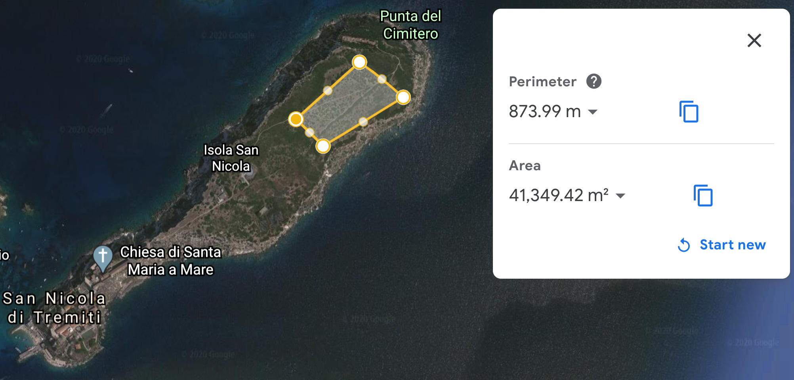

# Greenemiti
De-carbonizing [Tremiti Islands](https://en.wikipedia.org/wiki/Isole_Tremiti)

## General purpose

Tremiti islands (in Apulia region – South Italy), being quite isolated from Italian mainland, have always had issues with basic supplies like electricity or water.
Since years, the electricity has been produced by a [local company](https://www.germano-srl.it/), using diesel-powerd generator (~ 5 MW – see [smartisland.eu](http://www.smartisland.eu/en/replicabilita/tremiti.html)).
Only a small fraction (~ 0.6%) of the energetic need comes from renewables (~18 kW) ([isolesostenibili report](https://www.isolesostenibili.it/wp-content/uploads/2020/07/ENG_SustIslands2020_ISBN.pdf))   

The general purpose of this project is to cut down CO2 emissions from the main activities of the islands, namely, usual electricity consumption and turistic maritime and inland transportation, currently based on fossil fuels.

Similar actions have been already taken in different other islands of which, one of the most successfull case is probably the [small portuguese Berlenga island](https://www.publico.pt/2020/07/29/local/noticia/ilha-berlenga-troca-diesel-energia-solar-tornase-100-sustentavel-1926212).

## Need

### basal electric consumption

The current (diesel-based) mean annual electricity production is ~ **4 GWh / y** ([smartisland.eu](http://www.smartisland.eu/replicabilita/tremiti.html))

### water supply 

Fresh water supply for these types of islands is quite difficult and it's usually provided by water tankships ([isolesostenibili report](https://www.isolesostenibili.it/wp-content/uploads/2020/07/ENG_SustIslands2020_ISBN.pdf))

An greener alternative would be to produce it locally.
For instance, [Electric disalination with Reverse Osmosis](https://en.wikipedia.org/wiki/Desalination#Energy_consumption) requires about 5 kWh / m3 of water. 

Apulia region paid 1.9 M€/y to ship water to Tremiti islands, at a unitary cost about ~ 10 €/ m3.
This means a weater need of ~ 0.19 Mm3 / y, corresponding to    ~ **1 GWh / y**

### transportation

Transportation on and among islands is currently entirely based on standard thermal-engined vehicles and boats. 
Ideally, one could replace current boats with electric (batteries or H2-based) ones, with the advantage, once again, of cutting down carbon emissions, and being completely independent from mainland supply. 
This convertion to electric boats has for instance already started in Sweden, with the adoption of [Movitz electric ferries](http://www.greeningtheislands.net/index.php/nproject/movitz-electric-ferry/).
Trasportation within island, can be already quickly converted to EVs, such as (motor)bikes or little tracks.

In order to get a first estimate of the energetic need, let's consider using a Movitz electric ferry (which can carry up to 100 passengers):

* Let's assume:
	* the ferry needs 90 kW to cruise at 9 knots ~ 16 Km/h
	* a typical trip between S. Domino and S. Nicola islands return trip ~ 1 Km / trip
	* 10 trips / day ; 200 days / y (excluding low season)

* islands taxi boats' energetic need →  90 * 1 / 16  * 10 * 200 ~ 11 MWh / y

* longer trips around all islands are about 20 Km long, but they run ~ 5 trips / day, giving an extra factor of 10 → islands tours' energetic need ~ 100 MWh / y

In total, to run 1 taxi + 1 tour boats among Tremiti islands, one could start with a fist estimate of ~ **130 MWh / y** 

### summary

If we assume a total need of about 5.5 GWh / y, we would need to install about **4 MW** 

## Storage

Different solutions for REN energy storage have been investigated in few projects ([EC roadmap](https://ec.europa.eu/energy/intelligent/projects/sites/iee-projects/files/projects/documents/stories_maximization_of_the_penetration_of_res_in_islands.pdf)),
including mainly desalinization, pumped hydro and batteries.

Given the urgent need to cut down economic and carbon costs of shipping water by tankers, a first valuable solution for storage would be desalinizers (there is already one installed in  San Domino island, which does not meet the need  yet) (see also this [report by ENEA/ANCIM](https://www.enea.it/it/seguici/pubblicazioni/pdf-volumi/2019/libro_bianco_isole_minori.pdf)). 
This solution could both quickly help with energy storage, while allowing Treminti islands to be finally independent for the production of the ~ 0.2 Mm3 of water needed yearly (as it's alrady happening  in few other small island in Italy). The desalination plan was already approved in 2016, but probably bureacratic issues have critically slowed down its construction (see [related news](https://www.civico93.it/a-che-punto-e-la-realizzazione-del-dissalatore-alle-isole-tremiti/))

## Production (PV plants)

Here are few possible locations for PV plants, on different main islands

* San Domino Island:

	* advantage: closer to end-users, as it's the most populated island
	* disadvantage: [NIMBY](https://en.wikipedia.org/wiki/NIMBY) (?) – maybe better with an agrivoltaic plan

	 

* Capraia
	* advantage: no one leaves in this island  (no NIMBY)
	* best for long-term storage (water/batteries/...)

* San Nicola

 
 
 Summary of production potential

| Island     | Surface (m2) | Annual PV output (**) (GWh / y)|  
|------------|--------------|--------------------------------|
| San Domino | 82,000       | ~ 22                           | 
| Capraia    | 180,000      | ~ 51                           |    
| San Nicola | 40,000       | ~ 10                           |   

(**) upper-bound estimate, assuming a Global tilted irradiation (average annual irradiated power, at 32°/180° panels inclination): 1827 kWh / (m2 * y)
(data from 
[globalsolaratlas.info](https://globalsolaratlas.info/map?s=42.118254,15.49839&m=site&c=42.118254,15.49839,11)) and PV efficiency of 15%

## Costs

* PV installation: in order to install ~ 4 MW → ~ 4 M€ (assuming 1 €/W)
* Desalinizer: 3 M€ (already partially covered by EU -- [source](https://www.civico93.it/a-che-punto-e-la-realizzazione-del-dissalatore-alle-isole-tremiti/) )

## Resources

### literature

[EU-JRC 2019 report](https://ec.europa.eu/jrc/sites/jrcsh/files/kjna29938enn_1.pdf)

### initiatives

International organization: [greeningtheislands.net](http://www.smartisland.eu/en/)

Italian project:  [smartisland.eu](http://www.smartisland.eu/replicabilita/tremiti.html)
